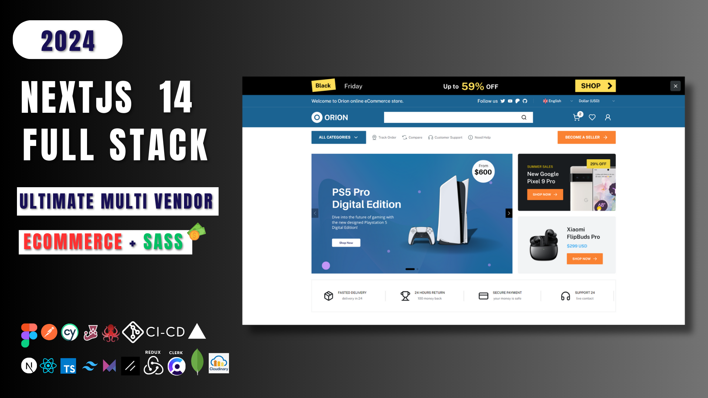

# Learn Backend developement with Nextjs - Full Course.

The API documentation is available from https://app.swaggerhub.com/apis-docs/SYLVAINCODEUR/Nextjs/1.0.0

## ✔️ Introduction

The main goal of this course is to help developers to build their own app from scratch with NextJs.

Watch, learn, do research, Try to  build your own project and DO NOT GIVE UP.

## Features 

ORION multi-vendor marketplace platform is standalone e-commerce software that allows you to build multi vendor marketplaces.

On the marketplace, multiple vendors market and sell their products through a single storefront. ORION multi vendor software supports an unlimited number of sellers on one marketplace. It's a perfect solution for online retail sales.

✔️ Ready-to-use Numerous Seller/Vendor Features

- Intuitive Seller Dashboard

- Unlimited Products Upload

- Unlimited Vendor Accounts

- Vendor Orders

- Vendor Shipments

- Vendor subscribe to premium

✔️Full Marketplace Control & Manage by Admin

- Approve/disapprove, Edit/Delete Vendor/seller Stores

- Mange categories

- Manage subcategories

- Mange sellers subscription

- Mange brands

- Manage collections

- Manage tags

## ❓ Who this course for

- Beginners in JavaScript

- Web developers

- Passionate learners 

## 📅 Course Structure

- First part :  Building scalable Back-end application for the online store

- Second part: Building Front-end Application including:

      Dashboard both admin - sellers

      Store Front Website and Customer Dashboard

## 🎯 What skills you will learn  ( Backend )

Throughout this course, you will improve your technical backend skill set such as:

- Understanding software development process

- Understanding software developer titles and roles

- Understanding API Principles

- Understanding Nextjs Basics Concepts

- Building robust APIs

- Securing API with token and Authorization 

- Securing API with CORS 

- DevOps CI-CD  with GitHub actions and Vercel

- Documenting API

## 🎯 What skills you will learn  ( Front-end ) 

- Learning how to integrate a full figma design from scratch using Tailwind Css and NextJs

- Learning Responsive design using Tailwind Css and NextJs

- Learning how to structure your Front-end application with NextJs

- Learning how to create reusable components with React and NextJs

- Learning how to integrate Restful APIs 

- Integrating client side validation with Zod Validator

- Learning NextJs Optimizations such as Server Side Rendering (SSR) , Static Side Generation (SSG) , Client Side Rendering (CSR), Incremental Static Regeneration (ISR)

- Learning Nextjs SEO Concepts and practices.

- Testing your application with Cypress.

## ✔️ Your tasks in this course

In this course you'll have tasks to do

- Part 1 : Back-end development

i won't actually build all the models schemas and routes API. I'm just going to show you how to do and it's going to be your turn. You're welcome

- So here are your tasks 

Create all models schemas ( refers to API docs schemas Sections )

Create all routes API. ( refers to API docs, API Sections )

## ❌ If you have issues: 

Get the source code and solve problems at your own.

your can do research using [ChatGPT](https://chatgpt.com/).

you can send me a message through [patreon](https://www.patreon.com/sylvaincodes) community section.

## ✅ Prerequisite knowledge

This course assumes knowledge of HTML, CSS, JavaScript.

## ✅ System requirements

Before you start this course, make sure you have the following installed:

Node.js 20.x or later installed.

Operating systems: macOS, Windows (including WSL), or Linux.

VSCode or another text editor of your choice.

## ⌛ TIMESTAMPS

00:00:00 Intro

00:02:10 Who is this course for?

00:02:56 Course structure

00:03:16 Part 1 : Structure

00:06:06 Part 1 : What you will learn ?

00:08:44 Demo Project

00:18:14 Basics Concepts Software development

00:22:43 Setting Back-end environment

00:37:24 DevOps Continuous Deployment

01:06:25 Setting Mongo Database

01:22:10 Setting Jest

01:40:42 DevOps Continuous Integration

02:08:35 Basics UML Concepts

02:10:32 Create Schemas with Mongoose

02:51:02 Secure API With Clerk Auth Token V5

03:02:08 Secure API Authorization with Clerk RBAC V5

03:09:10 API Principles

03:09:52 Create and Test API Routes for Tokens model

03:51:52 Secure APIs with CORS

03:58:19 Create and Test API Routes for Brands model

04:24:10 Deploy back-end project to Vercel

04:31:29 Document your API

04:58:02 What's Next in Part 2 ?

## DOWNLOAD ASSETS

🟢Online Store Website ORION MULTI VENDOR

- Store Website : [Orion Store](https://orion-store-prod.vercel.app)

- Figma Store Front : [Figma](https://www.figma.com/design/izslJAyRNNXZrlpoVAOCbK/Clicon---eCommerce-Marketplace-Website-Figma-Template-(Community)-(Community)?node-id=305-1334&node-type=frame&t=QYawDoflzX7ixlta-0)

🔴Admin - Seller Dashboard ORION MULTI VENDOR

- Dashboard Admin - Seller : [Admin-Sellers](https://orion-api-five.vercel.app/)

- API document link: [API Docs](https://app.swaggerhub.com/apis-docs/SYLVAINCODEUR/Nextjs/1.0.0#/)

## ✖️ Additional content ( SOURCE CODE )

- Source code Part 1:  back-end : [From github](https://github.com/sylvaincodes/youtube_orion_api)

- Source code Part 2:  front-end : Will be available when the part 2 is released

- Full Source code Part 1 and Part 2 : [Patreon](https://www.patreon.com/sylvaincodes)
